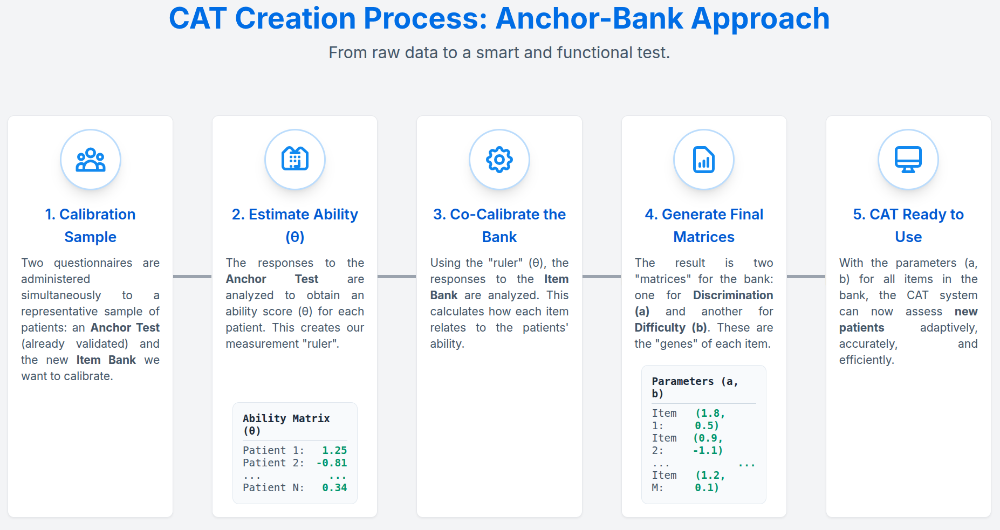

# visiaCat: A Computerized Adaptive Testing (CAT) Simulation Project

[](https://opensource.org/licenses/MIT)


## Overview

`visiaCat` is a comprehensive R project that demonstrates a full, end-to-end workflow for developing and evaluating a
Computerized Adaptive Test (CAT) based on Item Response Theory (IRT). This repository is one of the results of VisIA
project, a clinical trial to improve the early detection of suicidal ideation in adolescents. Funded
by [Xunta de Galicia through GPC ED431B 2024/36 grant and NextGeneration EU funds](https://portalcientifico.uvigo.gal/proyectos/651097/detalle?lang=es).

The primary goal is to simulate various CAT configurations to identify an optimal testing strategy that balances *
*precision** (low measurement error), **efficiency** (minimal test length), and **fairness** (no item bias across
clinical groups) for a set of psychological
questionnaires [see details in our paper](https://www.isca-archive.org/iberspeech_2024/ramirezsanchez24_iberspeech.pdf).

This project is structured as a professional R package to showcase best practices in software development, including
modular code, dependency management, automated documentation, and a reproducible analysis pipeline.

## The problem we solve

Traditional psychological assessments for suicidal ideation are base on the use of **long** and **fixed-length**
strandar instruments. They often require participants to answer hundreds of questions, leading to fatigue and unreliable
responses. `visiaCat` use the approach of Computerized Adaptive Testing to:

1. **Select only the most informative question for each participant** in real-time.
2. **Stop the test as soon as a target precision is reached**.

Result: **shorter assessments, equal or better accuracy**.

<p align="center">
  
</p>

---

## Solution highlights

### 🚀 End-to-end, reproducible pipeline

* Data prep → IRT calibration → CAT simulation → validation – all scripted and version-controlled.
* **Parallel processing** slashes simulation time from hours to minutes.

### 🧮 Fixed-anchor co-calibration

Ensures items from different scales live on a **single universal metric** so scores stay comparable across studies.

<p align="center">
  
</p>

### 📊 Validation focused on fairness & efficiency

* Differential Item Functioning (DIF) checks for bias across clinical groups.
* Item-exposure analysis protects item security.

---

## Skills & tech showcased

* **Languages / Tools / Libraries** – `R` / `Git` / `tidyverse`, `mirt`, `future`, `pkgdown`.
* **Concepts** – Item Response Theory, Adaptive Algorithms, Statistical Validation, Bayesian Inference.
* **Software practises** – functional programming, modular package design, automated documentation, reproducible
  research.

---

## Key Features

- **Modular R Package Structure**: All core logic is encapsulated in functions within a formal R package, promoting
  reusability and maintainability.
- **End-to-End Psychometric Workflow**:
    1. **Data Preparation**: Cleans, merges, and preprocesses raw response data.
    2. **Fixed-Anchor Calibration**: Calibrates a large item bank against a common set of anchor items.
    3. **CAT Simulation**: Simulates multiple CAT scenarios with varying item selection rules and stopping criteria.
    4. **In-depth Validation**: Analyzes results for overall performance, group-level fairness, Differential Item
       Functioning (DIF), and item exposure rates.
- **Efficient and Reproducible Pipeline**:
    - **Parallel Processing**: Leverages the `parallel` and `pbapply` packages to dramatically speed up the execution of
      multiple simulation scenarios.
    - **Separated Scripts**: The workflow is logically divided into a main simulation script and separate, focused
      analysis scripts.
- **Automated Documentation**: Utilizes `roxygen2` and `pkgdown` to generate a complete and professional documentation
  website.

---

## Project Structure

The project is organized to maintain a clean separation between the package source code, analysis scripts, data, and
outputs.

- `R/`: Contains all the core functions of the `visiaCat` package.
- `analysis/`: Holds the main scripts used to run the analysis pipeline and generate reports.
- `data/`: Stores the raw and processed data used in the analysis.
- `man/`: Contains the function documentation files, automatically generated by `roxygen2`.
- `vignettes/`: Holds long-form tutorials, such as the main project walkthrough.
- `docs/`: Contains all files for the `pkgdown` documentation website.
- `output/`: Stores all generated artifacts, including plots, reports, and simulation results.
- `DESCRIPTION`, `NAMESPACE`: Core files that define the R package and its dependencies.

---

## Workflow and How to Use

This project has a multi-stage workflow. Follow these steps to reproduce the analysis.

### Step 0: Installation

First, install the `visiaCat` package directly from GitHub.

```R
# install.packages("devtools")
devtools::install_github("jmramirez/visiaCat")
```

### Step 1: Run the Main Simulation Pipeline

This is the primary script that runs the data preparation, calibration, and all CAT simulation scenarios. It can be
time-consuming, as it generates all the core results.

```R
# This script will generate all the necessary .rds and .csv files in the 'output/' directory.
source("analysis/run_cat_simulations.R")
```

### Step 2: Run Post-Hoc Analyses (Optional)

After the main pipeline has been run, you can use the standalone analysis scripts to investigate the results without
re-running the simulations.

1. Analyze Item Exposure Rates

This script analyzes the item usage patterns for a specific CAT scenario. You must edit the script to define which
scenario you want to analyze.

```R
# Edit the configuration variables inside the script first, then run:
source("analysis/analyze_cat_results.R")
```

2. Run DIF Analysis
   This script runs the computationally expensive Differential Item Functioning (DIF) analysis. It should be run
   separately and it takes a long time to finish.

```R
# This script loads the processed data and runs the DIF analysis.
source("analysis/run_dif_analysis.R")
```

## License

This project is licensed under the MIT License - see the LICENSE.md file for details.

## Author

José M. Ramírez @ Universidade de Vigo
